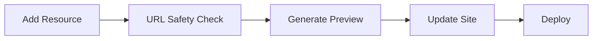

# 🖼️ Preview Image Generation System

Automatically captures and optimizes screenshots of resource URLs to create beautiful preview images for the site.

## Overview

When resources are added to CSOH, preview images make them more visually appealing and help users identify resources at a glance. This system automates the entire preview image creation process.

## How It Works

### 🤖 Automatic Generation (GitHub Actions)

When you add a new resource:

1. **PR Created** - You add a resource to `resources.html`
2. **Workflow Triggered** - GitHub Actions detects the change
3. **Missing Previews Detected** - Checks which URLs don't have preview images
4. **Screenshots Captured** - Uses Playwright to take screenshots
5. **Images Optimized** - Resizes to 400x300px, optimizes to <150KB
6. **Mapping Updated** - Updates `preview-mapping.json`
7. **Committed to PR** - Automatically commits images to your PR branch

**No manual work required!** The workflow handles everything.

### 🔧 Manual Generation (Local Tool)

You can also generate previews locally:

```bash
# Generate preview for a single URL
python3 tools/generate_preview.py "https://github.com/prowler-cloud/prowler"

# Check which resources need previews
python3 tools/generate_preview.py --check

# Generate all missing previews
python3 tools/generate_preview.py --batch-auto
```

### 📦 Integrated in Submission Tool

The interactive submission tool offers preview generation:

```bash
python3 tools/submit_resource.py
```

After entering resource details:
```
🖼️  Generate preview image automatically? (y/n, default=y): y

🖼️  Generating Preview Image
This may take 10-30 seconds...
✅ Preview generated successfully
   Preview: img/previews/github.com-prowler-cloud-prowler.jpg
```

## Technical Details

### Multiple Capture Methods

The system tries multiple methods in order:

1. **Playwright** (Best quality)
   - Headless Chromium browser
   - Full JavaScript rendering
   - Waits for page load
   - Requires: `pip install playwright && playwright install chromium`

2. **Screenshot API** (Fallback)
   - Uses thum.io free API
   - No dependencies required
   - Good for simple pages
   - Rate limited to prevent abuse

3. **Placeholder** (Last resort)
   - Creates a simple image with text
   - Ensures all resources have an image
   - Better than broken images

### Image Processing

- **Target Size**: 400x300 pixels
- **Format**: JPEG with 85% quality
- **Optimization**: Strips metadata, progressive encoding
- **File Size**: Typically 50-150KB per image

### File Organization

```
img/previews/
├── github.com-prowler-cloud-prowler.jpg
├── aws.amazon.com-security-blog.jpg
├── owasp.org-project-eks-goat.jpg
└── ...

preview-mapping.json
{
  "https://github.com/prowler-cloud/prowler": "img/previews/github.com-prowler-cloud-prowler.jpg",
  "https://aws.amazon.com/security/blog": "img/previews/aws.amazon.com-security-blog.jpg",
  ...
}
```

## GitHub Actions Workflow

**Location**: `.github/workflows/generate-previews.yml`

**Triggers**:
- Pull requests modifying `resources.html`
- Pushes to main modifying `resources.html`
- Manual workflow dispatch

**Steps**:
1. Install Python and dependencies (Playwright, Pillow)
2. Check for missing previews
3. Generate screenshots for URLs without previews
4. Optimize images with jpegoptim
5. Commit and push to PR branch or main
6. Comment on PR with summary

**Environment**:
- Ubuntu latest
- Python 3.x
- Chromium browser (via Playwright)
- jpegoptim for final optimization

## Usage Examples

### Check Status
```bash
$ python3 tools/generate_preview.py --check

🔍 Checking for resources without previews...

📋 Found 3 resources without previews:

  • https://github.com/prowler-cloud/prowler
  • https://github.com/aquasecurity/trivy
  • https://www.wiz.io/blog

💡 Generate previews with:
   python3 tools/generate_preview.py --batch-auto
```

### Generate Single Preview
```bash
$ python3 tools/generate_preview.py "https://github.com/prowler-cloud/prowler"

🖼️  Generating preview for: https://github.com/prowler-cloud/prowler
  📁 Output: img/previews/github.com-prowler-cloud-prowler.jpg
  📸 Using Playwright to capture https://github.com/prowler-cloud/prowler
  ✅ Screenshot captured with Playwright
  🔧 Optimizing image...
  ✅ Optimized to 87KB (400x300)
  📋 Updated preview-mapping.json

✅ Success! Preview saved to: img/previews/github.com-prowler-cloud-prowler.jpg
```

### Batch Generate
```bash
$ python3 tools/generate_preview.py --batch-auto

🔄 Generating previews for all resources without images...

📋 Processing 3 URLs...

[1/3] Processing https://github.com/prowler-cloud/prowler
  ✅ Preview generated successfully

[2/3] Processing https://github.com/aquasecurity/trivy
  ✅ Preview generated successfully

[3/3] Processing https://www.wiz.io/blog
  ✅ Preview generated successfully

✅ Generated 3/3 previews
```

### Custom Filename
```bash
python3 tools/generate_preview.py "https://example.com" custom-name.jpg
```

## Dependencies

### Required
- Python 3.6+
- `Pillow` (PIL) - Image processing

### Optional (for better quality)
- `playwright` - Best screenshot quality
  ```bash
  pip install playwright
  playwright install chromium
  ```

### Fallback
If no dependencies installed:
- Uses screenshot.guru API (free, no auth)
- Creates placeholder images if API fails

## Customization

Edit `tools/generate_preview.py` to customize:

```python
# Configuration
TARGET_WIDTH = 400          # Preview width in pixels
TARGET_HEIGHT = 300         # Preview height in pixels
SCREENSHOT_TIMEOUT = 30     # Seconds to wait for page load
```

## Troubleshooting

### "Playwright not installed"
```bash
pip install playwright
playwright install chromium
```

### "PIL not installed"
```bash
pip install Pillow
```

### Preview is blank/black
- Some pages block headless browsers
- Falls back to API method automatically
- May create placeholder if both fail

### Rate limiting
- Screenshot API has rate limits
- Add delays between batch generation
- Use local Playwright for bulk operations

### File size too large
Images are automatically optimized to ~85% quality and resized to 400x300px. If still too large:
- Increase compression (lower quality number)
- Use jpegoptim: `jpegoptim --max=80 img/previews/*.jpg`

## Best Practices

1. **Use GitHub Actions** - Let automation handle it
2. **Test locally first** - For bulk operations
3. **Check existing previews** - Avoid regenerating
4. **Custom images welcome** - You can always replace auto-generated previews
5. **Commit early** - Preview generation can take time

## Workflow Integration

The preview generation integrates seamlessly with other workflows:



1. Resource added to `resources.html`
2. URL safety workflow validates all URLs
3. Preview generation workflow creates images
4. SRI hash workflow updates integrity hashes
5. Deploy workflow pushes to production

## Performance

- **Single preview**: 5-20 seconds
- **Batch (10 URLs)**: 1-3 minutes
- **Full site scan**: 5-10 minutes (260+ resources)

The workflow only generates missing previews, not all images every time.

## Future Enhancements

Potential improvements:
- [ ] Video preview gifs for demo sites
- [ ] AI-powered preview image selection
- [ ] Multiple screenshot sizes
- [ ] Dark mode preview variants
- [ ] Favicon extraction and inclusion
- [ ] Social media card generation

## See Also

- [Interactive Submission Tool](SUBMIT_RESOURCE_README.md) - Uses preview generation
- [URL Safety Checker](CHECK_URL_SAFETY_README.md) - Validates URLs
- [GitHub Workflows](.github/workflows/) - Automation configuration

---

**Made with ❤️ by the Cloud Security Office Hours Community**
